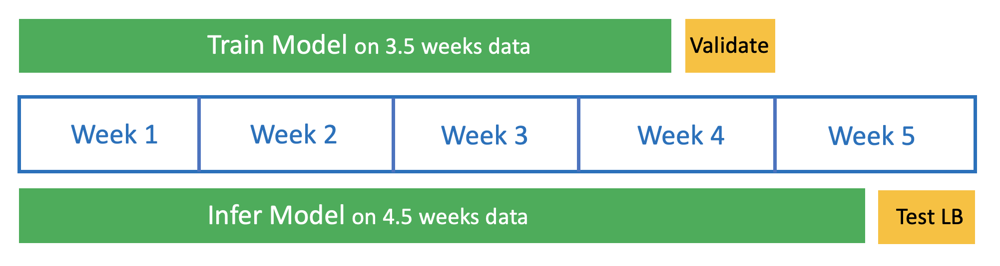

# 3rd Place Solution - Kaggle-OTTO-Comp - Chris' Part
In Kaggle's OTTO competition, we need to build a model that predicts what a user will click, cart, and order in the future at online ecommerce website https://otto.de We are given 4.5 weeks of data and must predict the next 0.5 week. More details are explained at Kaggle [here][1] and final leaderboard is [here][2]. Our team of Benny, Chris, Giba, and Theo won 3rd place cash gold! Our detailed writeup is published [here][3](Chris), [here][4](Theo), and [here][5](Benny)

# Code for 15th Place Gold Single Model
The code in this GitHub repo, will create Chris' 15th place solo gold single model which achieves CV 0.601 and LB 0.601. When we ensemble the single models of Benny, Chris, Giba, Theo, we achieve 3rd place cash gold with Private LB 0.6038 and Public LB 0.6044. 

The following image will help understand the organization of code in this repo. First we train a model on the first 3.5 weeks of data. Then we infer our model on 4.5 weeks of data. Therefore we will basically run the same pipeline twice:



# How To Run Code
My single model is a "candidate rerank" model. Therefore first we generate 100 item candidates for each user. Then we select 20 using XGB ranker model. Here are 3 main steps with substeps:
* **(1) Download Data from Kaggle**
* => Run `/data/make_train_valid.ipynb`
* **(2) Train Models**
* => compute co-visit matrices by running `/train/covisit_matrices/script.ipynb`
* => generate candidates and scores with `/train/candidates/script.ipynb`
* => engineer features with `/train/item_user_features/script.ipynb`
* => merge candidates and features for click model with `/train/make_parquets/script-1.ipynb`
* => train click model with `/train/ranker_model/XGB-186-CLICKS.ipynb`
* => merge candidates and features for cart and order model with `/train/make_parquets/script-2.ipynb`
* => train cart model with `/train/ranker_model/XGB-406-CARTS.ipynb`
* => train order model with `/train/ranker_model/XGB-412-ORDERS.ipynb`
* **(3) Infer Models**
* => compute LB co-visit matrices by running `/infer/covisit_matrices_LB/script.ipynb`
* => generate LB candidates and scores with `/infer/candidates_LB/script.ipynb`
* => engineer LB features with `/infer/item_user_features_LB/script.ipynb`
* => merge LB candidates and features for click model with `/infer/make_parquets_LB/script.ipynb`
* => infer models with `/infer/inference_LB/script.ipynb`

After running the steps above, the file `/data/submission_final/submission_v186v406v412_with_click_oof.csv` is generated. 
This file will score Private LB 0.6012 and Public LB 0.6010. To achieve a better CV and LB, we can train CatBoost with the
code `/train/ranker_model/CAT-200-orders.ipynb` and `/train/ranker_model/CAT-203-carts.ipynb` and change inference to infer
CatBoost. The result is Private LB 0.6018 and Public LB 0.6016. We discovered that CatBoost was better after the competition
ended.


```
├── train
│   ├── covisit_matrices         # Compute matrices with RAPIDS cuDF
│   ├── candidates               # Generate candidates from matrices
│   ├── item_user_features       # Feature engineering with RAPIDS cuDF
│   ├── make_parquets            # Combine candidates, features, targets
│   └── ranker_models            # Train XGB model
├── infer        
│   ├── covisit_matrices_LB      # Compute matrices with RAPIDS cuDF
│   ├── candidates_LB            # Generate candidates from matrices
│   ├── item_user_features_LB    # Feature engineering with RAPIDS cuDF
│   ├── make_parquets_LB         # Combine candidates, features, targets
│   └── inference_LB             # Infer XGB model with RAPIDS FIL
├── data    
│   ├── make_train_valid.ipynb   # Run to download data
│   ├── train_data               # Train data downloaded to here
│   ├── infer_data               # Infer data downloaded to here
│   ├── covisit_matrices         # Matrices stored here
│   ├── candidate_scores         # Candidate lists and scores here
│   ├── item_user_features       # Item and user features here
│   ├── train_with_features      # Train data with features merged
│   ├── infer_with_features      # Infer data with features merged
│   ├── models                   # Trained models here
│   ├── submission_parts         # Partial submission.csv here
│   └── submission_final         # Final submission.csv here
└── README.md
```

[1]: https://www.kaggle.com/competitions/otto-recommender-system/overview
[2]: https://www.kaggle.com/competitions/otto-recommender-system/leaderboard
[3]: https://www.kaggle.com/competitions/otto-recommender-system/discussion/383013
[4]: https://www.kaggle.com/competitions/otto-recommender-system/discussion/382975
[5]: https://www.kaggle.com/competitions/otto-recommender-system/discussion/386497
